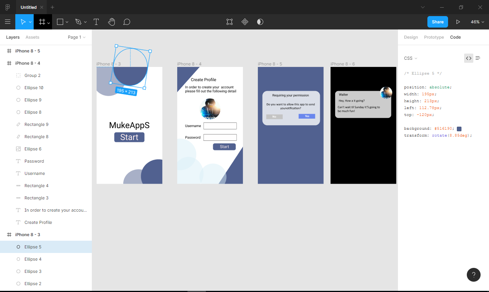
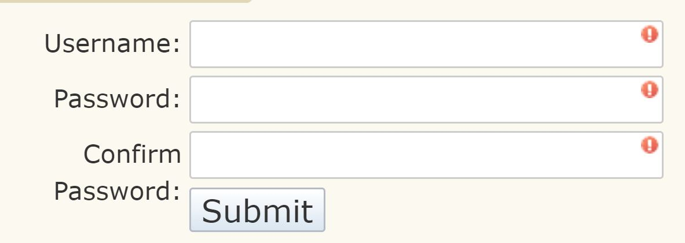

# MukeApps - Test for Entry Level Full Stack Software Engineer 

## (A) What does it take to be a Full Stack Software Engineer at MukeApps ?
 
### (1) Interview question 1 ? what's your Love and dedication to Learn software Engineering ?
- We all know from movies that Software Engineer are portraied as being super smart.
- The truth is that Love and Dedication is better suited for this field than to be a genius.
- Most of the programming languages uses basic Math like Algebra. You know the answer of 2x=10. What's x ? Congratulation, you have the potential to be a software Engineer.
- To be a successful Software engineering, all you need is logic, love and dedication. 
- Why ? When coding, we don't write Math formulas , we write programming language logic for the 
PC to understand. It's the same as speaking a human language like French or English
- Love and Dedication ? Programming isn't hard but require love, patience and dedication because you ll keep learning as long as you live. It never ends. the way i see it as like learning to ride a bike then learning to master it everyday. No complicated but you ll never achieve a perfect balance to ride a bicycle.

## (B) Test 1 : UX Designer skills 
Notes : UX_Designer.pdf
Please complete the design below (Use direction in pdf above)

## (C) Test 2 : Web Designer skills 
Notes : 000_Welcome_Message-FREE.pdf
Please complete the design below:
 - Create a simple login page Username and password with HTML and CSS
 - Use Javascript and Jquery for the validation
 - Push your code to github
 - display a static website using github.io.pages

